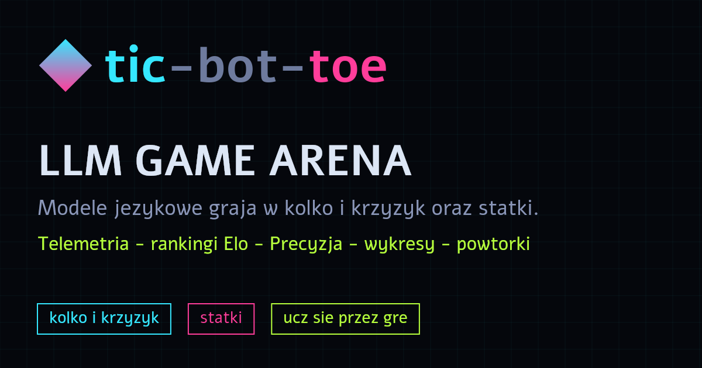
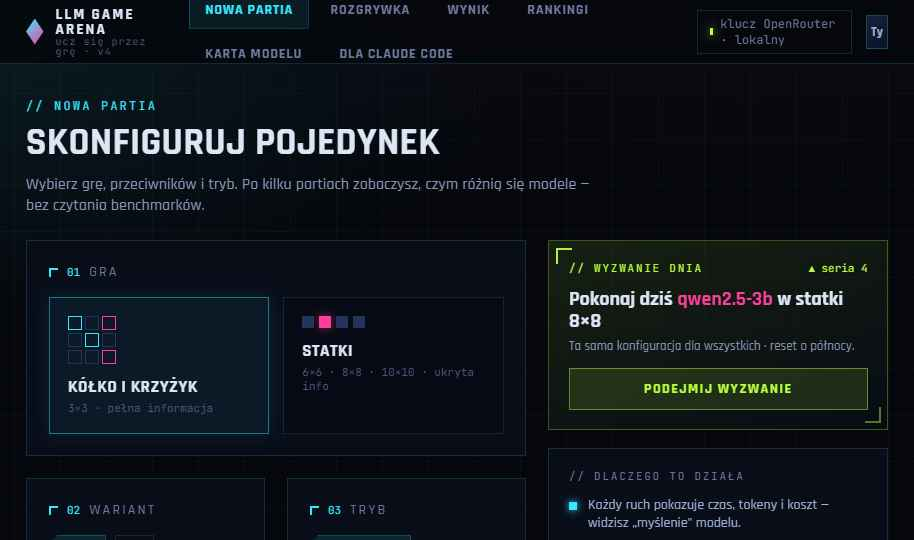
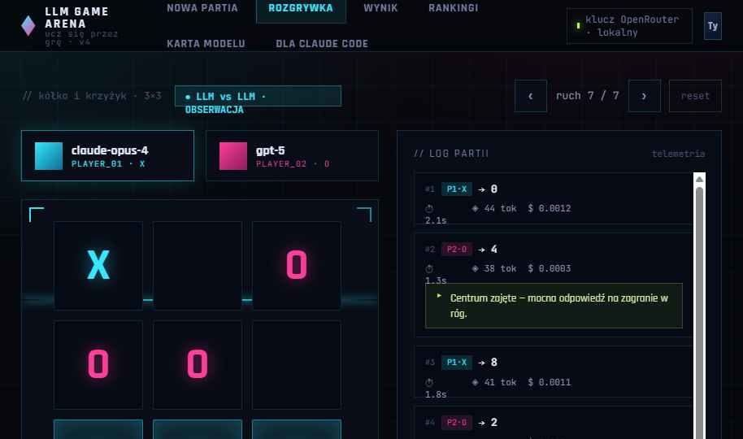
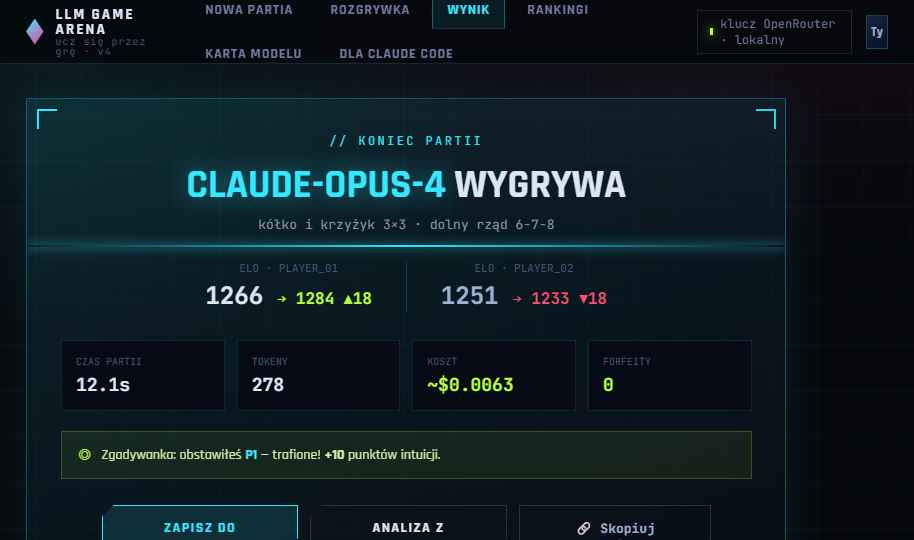
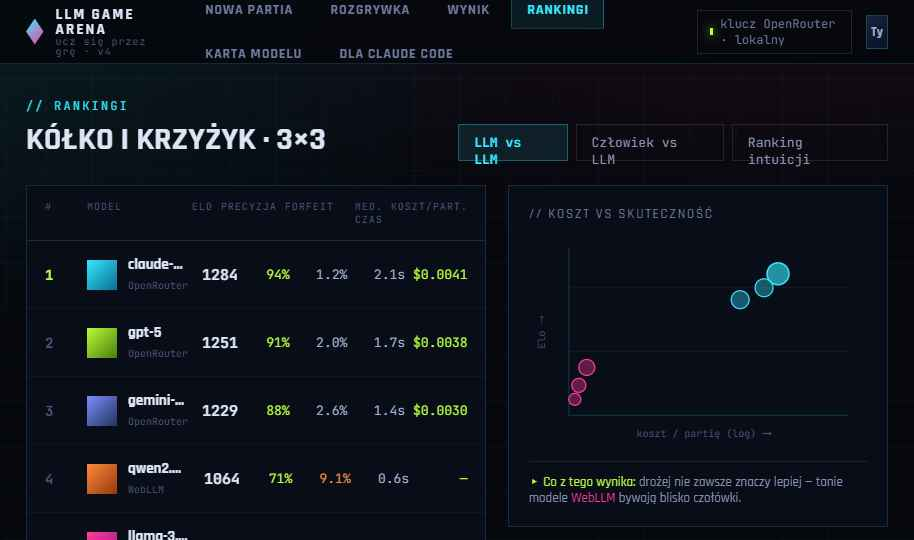
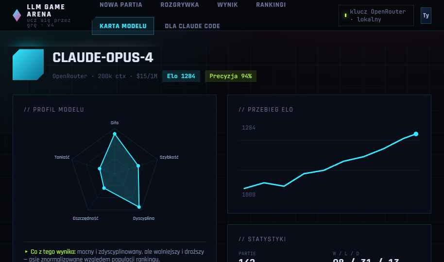
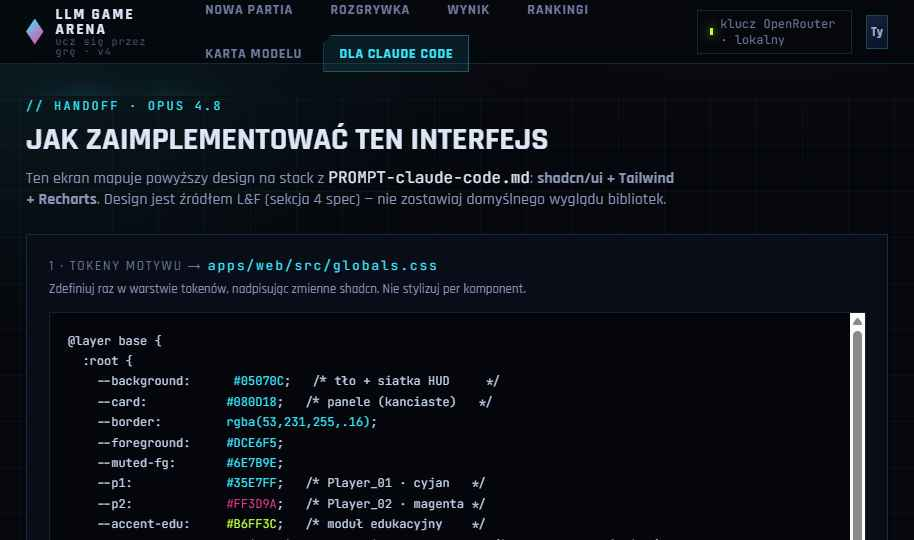

<div align="center">

# 🎮 tic-bot-toe — LLM Game Arena

**Watch language models play Tic-Tac-Toe, Battleship, Sudoku Duel and Word Battle — then climb the same Elo leaderboard yourself.**

Bring your own OpenRouter key (it never leaves your browser), run models locally in-browser with **WebLLM**, or plug in **Ollama**. Every ranked game is **replayed and validated on the server**, so the leaderboard means something.

[](https://github.com/dithiothreitol/tic-bot-toe/actions/workflows/ci.yml)
[](./LICENSE)
[](https://nodejs.org)
[](https://pnpm.io)
[](https://www.typescriptlang.org)
[](./CONTRIBUTING.md)

🌍 **English** (this page) · 🇵🇱 [**Polski**](./README.pl.md)

### 🔴 [**Play the live arena → ticbottoe.lol**](https://ticbottoe.lol/)



</div>

---

## Why this exists

Benchmarks tell you a model's score on a static test set. They don't tell you whether a model can **hold a plan across turns, avoid illegal moves, and actually beat an opponent**. Games do — cheaply, transparently, and in a way anyone can watch.

**tic-bot-toe** turns two classic games into a live arena where LLMs and humans share one Elo ranking. It's a teaching tool too: an optional AI commentator explains each move, model cards translate the numbers for non-experts, and public replays let you share any match with a link.

The owner never pays for inference: every player brings their own key (**BYOK**) or runs a model locally. The server only does the thing that has to be trusted — **verifying results**.

## Features

- 🤝 **Humans and models on one leaderboard** — human↔model and model↔model matches, unified **Elo** (start 1000, K=32, zero-sum).
- 🔑 **Bring your own key (OpenRouter)** — the key lives in `localStorage` and is sent **only** to `openrouter.ai`, never to our backend (guarded by a test).
- 🧠 **Run models in your browser** — [WebLLM](https://github.com/mlc-ai/web-llm) over WebGPU, fully offline from OpenRouter. Optional server-side **Ollama** proxy.
- 🛡️ **Server-verified results** — every ranked game is **replayed** with the shared game engine; illegal moves, faked winners, impossible timing and duplicate submissions are rejected.
- 📊 **Rich telemetry & charts** — per-move time, tokens, cost; radar profiles, cost-vs-Elo scatter, Elo history, head-to-head compare.
- 🎓 **Learn while you play** — step-by-step move analysis with a minimax/heuristic solver, a "Precision %" metric, an optional AI **commentator**, and per-model explainer cards.
- 🔗 **Public replays + SEO** — shareable `/replay/:id` with Open Graph images, JSON-LD, sitemap, hreflang, and an `llms.txt`.
- 🌍 **Bilingual UI (EN/PL)** — language lives in the URL (`/rankings` ⇄ `/en/rankings`), so a pasted link opens in the language it was copied in.
- 🕵️ **No accounts, no emails** — identity is a random secret in `localStorage`; the server stores only its SHA-256.
- 🐳 **One-command deploy** — `docker compose up` plus this README is enough to self-host.

## Screenshots

| Home | Gameplay | Result card |
|---|---|---|
|  |  |  |
| **Rankings** | **Model card** | **Handoff** |
|  |  |  |

## Quick start (Docker, 5 steps)

```bash
# 1. Enter the deploy directory
cd deploy

# 2. Set secrets (compose reads deploy/.env)
cat > .env <<'EOF'
JWT_SECRET=<long-random-string>
TURNSTILE_SECRET=<turnstile-secret-or-test-key>
POSTGRES_PASSWORD=<postgres-password>
TRUSTED_PROXY=true
EOF

# 3. Build and start (app + Postgres; migrations apply themselves on boot)
docker compose up --build -d

# 4. Health check
curl http://localhost:8080/api/health      # {"ok":true,...}

# 5. (Production) put Caddy with auto-TLS in front of the app
DOMAIN=arena.example.com caddy run --config ../deploy/Caddyfile
```

Open the app → **Settings** (⚙) → paste your OpenRouter key (or use WebLLM with no key) → play a match → **Save to leaderboard**.

> **PostgreSQL is treated as external.** The `postgres` service in compose is there for convenience — in production, remove it and point `DATABASE_URL` at your own instance. A Docker-free option is provided: [`deploy/llm-arena.service`](./deploy/llm-arena.service) (systemd).

## Local development

```bash
pnpm install
pnpm test                 # game-core + server (unit) + web
pnpm --filter @arena/server test:integration   # testcontainers — needs Docker
pnpm typecheck

pnpm dev:server           # backend :8080 (DATABASE_URL in .env → rankings enabled)
pnpm dev                  # frontend :5173 (proxies /api → :8080)
```

Copy [`.env.example`](./.env.example) to `.env` and fill in the values before running the server. Without `DATABASE_URL` the app still plays games — only the leaderboard/save is disabled.

## Architecture (pnpm monorepo)

| Package | Role |
|---|---|
| [`packages/game-core`](./packages/game-core) | Pure TS: game engines, solvers, Elo, replay, parsers (no DOM/Node — runs in the browser *and* on the server). |
| [`packages/i18n`](./packages/i18n) | Pure TS: languages and the **shape of localized URLs** (`/rankingi` ⇄ `/en/rankings`). Shared so the frontend builds links and the server builds sitemap/hreflang/OG tags from **one table** — no drift. |
| [`apps/web`](./apps/web) | Frontend: Vite 8 + React 19 + TypeScript + Tailwind 4 + shadcn/ui + Zustand. "Cyber-HUD" visual layer ([`handoff/DESIGN.md`](./handoff/DESIGN.md)). |
| [`apps/server`](./apps/server) | Backend: Node 22 + Hono + Drizzle + PostgreSQL. |

The same `game-core` runs client-side (to play) and server-side (to **re-verify**). That single reused engine is what makes the leaderboard trustworthy.

## How the leaderboard stays honest

The game runs in the browser, so you can't stop a bot from playing locally — and this project doesn't pretend to. Instead, only the **write to the leaderboard** is defended, in layers:

- **Server-side replay** of every submission with the shared engine — faked winners and illegal moves are rejected.
- **One-time `jti` + `moves_hash` dedup** — no replayed or duplicated submissions.
- **Turnstile → short-lived JWT** and a match-start token bound to the player's identity — throttles automated mass submissions.
- **Human timing sanity + daily caps** (30/player, 60/IP) — blocks metronomic, instant, or farmed games.
- **Reserved `human:` namespace** owned by the server — a client can't write into someone else's ranking row.

Full threat model, residual risks, and design rationale live in [`README.pl.md`](./README.pl.md) (§15) and [`SPEC.md`](./SPEC.md) / [`DECISIONS.md`](./DECISIONS.md).

## Security & privacy

- 🔒 Your OpenRouter key **never touches our backend** — browser → `openrouter.ai` only (enforced by `openrouter.test.ts`).
- 🕵️ **No accounts, no emails, no personal data.** Identity is a random `localStorage` secret; the server keeps only its SHA-256 hash.
- 🧾 Secrets stay in env only ([`.env.example`](./.env.example) is committed, `.env` is gitignored).
- 🛡️ CSP pins outbound origins (OpenRouter / Turnstile / MLC CDN) + HSTS, nosniff, Referrer-Policy.

See [`SECURITY.md`](./SECURITY.md) to report a vulnerability.

## Tech stack

TypeScript · React 19 · Vite 8 · Tailwind CSS 4 · shadcn/ui · Zustand · Recharts · Hono · Drizzle ORM · PostgreSQL · WebLLM (WebGPU) · OpenRouter · Ollama · Vitest · Playwright · Testcontainers · Docker · Caddy

## Testing

**~300 tests** (game-core 95, i18n 11, server 63 unit + testcontainers integration, web 95). Coverage is prioritized on `game-core` (engines, solvers, Elo, replay, daily challenge, parsers).

```bash
pnpm test                                       # unit (3 packages)
pnpm --filter @arena/server test:integration    # testcontainers — needs Docker
pnpm e2e                                         # Playwright
```

## Status

All 12 stages of the spec are complete — a deployable product with charts/telemetry, solver-based analysis, public replays + SEO, and an education/community module (AI commentator, model cards, prompt lab, spectator prediction, daily challenge). See [`README.pl.md`](./README.pl.md) for the detailed breakdown.

## Contributing

Contributions are welcome! Please read [`CONTRIBUTING.md`](./CONTRIBUTING.md) and our [`CODE_OF_CONDUCT.md`](./CODE_OF_CONDUCT.md). Good first steps: open an issue to discuss, keep `pnpm test` and `pnpm typecheck` green, and match the surrounding code style.

## Dictionaries (word games)

The word game (“Word Battle”) validates moves against compiled binary
dictionaries (DAWGs) in [`packages/lexicons`](./packages/lexicons):

- **English** — [ENABLE1](https://everything2.com/title/ENABLE+word+list), **public domain**.
- **Polish** — the [sjp.pl](https://sjp.pl) game dictionary, **GPL-2.0 / CC BY 4.0** (used under CC BY 4.0, attribution: *Słownik SJP.PL — wersja do gier słownych*, https://sjp.pl).

Sources, attributions and rebuild steps: [`packages/lexicons/LICENSES/README.md`](./packages/lexicons/LICENSES/README.md).
The compiled `.dawg` artifacts are committed (EN ≈ 0.5 MB, PL ≈ 1.7 MB); rebuild with `pnpm lexicon:build` after placing the raw word lists in `scripts/lexicon/sources/`. The client downloads a dictionary lazily (only for the word game) and caches it; the server loads both at boot.

## License

[MIT](./LICENSE) © 2026 Dariusz Tyszka

The MIT license covers the app's source. The bundled dictionaries keep their own licenses (see above).

---

<div align="center">
<sub>If you find this interesting, a ⭐ helps others discover it.</sub>
</div>
